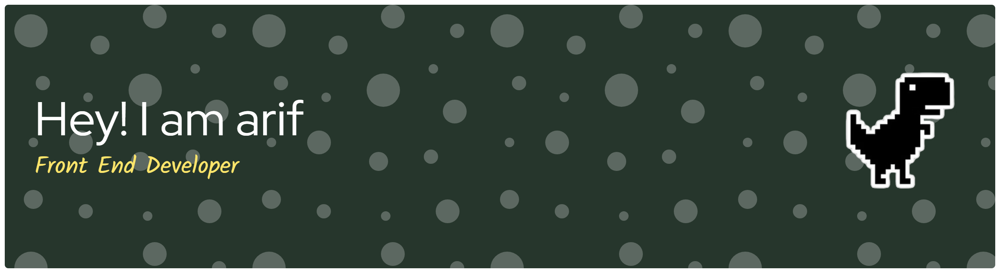

<!-- ================= HEADER ================= -->

  

  

  

  
  
  
  

---

## 👨‍💻 About Me

🎓 Informatics Student at **Fasilkom-TI Universitas Sumatera Utara**  
💻 Focused on building scalable & maintainable front-end systems  
📱 Passionate about Flutter & modern web technologies  
🎨 Strong interest in UI consistency & user-centered design  
🐱 Cat enthusiast  

> “I don’t just write code. I engineer user experiences.”

---

## 🚀 Currently Exploring

- Front-End Architecture Patterns  
- Scalable Mobile Apps with Flutter  
- Clean Code & Reusable Component Systems  
- Performance Optimization  
- Advanced Data Structures & Algorithms  

---

## 💡 What I Can Do

✔️ Build responsive & modern interfaces  
✔️ Transform Figma designs into production-ready apps  
✔️ Integrate RESTful APIs  
✔️ Lead & manage small development teams  
✔️ Deliver end-to-end project workflows  

---

## 🛠 Tech Stack

  

---

## 📌 Featured Projects

| Project | Description | Tech Stack | Role |
|----------|------------|------------|------|
| **RentalPartner** | Web-based car rental system with booking workflow, authentication & dashboard | Laravel, Tailwind CSS, MySQL | Front-End Developer |
| **Bookora** | Responsive book discovery platform with advanced search | Flask, HTML, CSS | Front-End Developer |
| **PetPartner** | Integrated mobile pet-care service application | Flutter, Dart, Figma | Project Manager, UI/UX Designer, Front-End Developer |
| **AIMS** | Academic management system with role-based access control | Laravel, Tailwind CSS, MySQL | Project Manager, Front-End Developer |

---

## 🔥 GitHub Analytics

  

  
  

  

---

## 🎧 Currently Vibing

  

---

## 🐍 Snake

  

---

## 📈 Activity Graph

  

---

## 🌐 Connect With Me

  
  
  

---

  

⚡ Always Learning • Always Building • Always Improving ⚡

